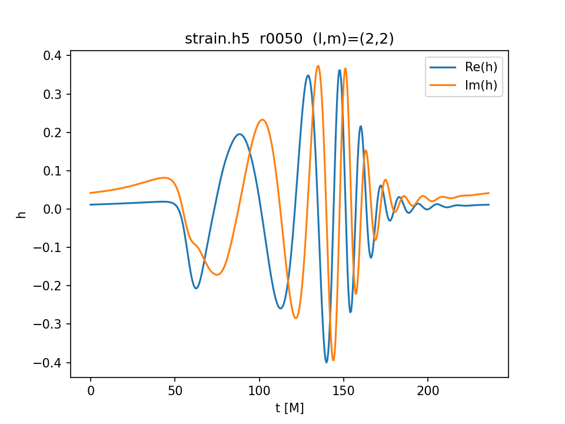

# Numerical-Relativity Workflow: \Psi_4 \rightarrow h(t) via Fixed-Frequency Integration (FFI)

This repository documents a reproducible workflow used in my Master's thesis work on numerical-relativity simulations with **AthenaK**:
1) running jobs on the **Mahti** supercomputer (Slurm job scripts), and
2) post-processing extracted gravitational-wave data to compute the **strain** \(h(t)\) from the Weyl scalar \(\Psi_4\) using **fixed-frequency integration (FFI)**.

The focus is on a clean, job-ready structure: readable scripts, reproducible analysis on a small example dataset, and HPC templates that can be adapted to different allocations and partitions.

## Repository structure

- `analysis/ffi/` — FFI pipeline (compute strain, filters, diagnostics, tests)
- `hpc/mahti/` — Slurm job templates for Mahti (CPU/GPU variants + notes)
- `data/example_input/` — small example inputs for quick local testing
- `docs/` — workflow overview and curated figures

## Quick start (example)

Create a virtual environment, install dependencies, and run the example pipeline:

    python3 -m venv .venv
    source .venv/bin/activate
    python -m pip install -r environment/requirements.txt

    bash scripts/run_example.sh

Outputs (plots and small files) are written to `data/example_output/` (kept small by design).

## Example output

## Running on Mahti (Slurm)

The Slurm job scripts used for the Mahti supercomputer are in `hpc/mahti/`:
- `hpc/mahti/job_cpu.slurm`
- `hpc/mahti/job_gpu.slurm`

See `hpc/mahti/README.md` for usage notes.

Example strain plot (computed from the included `rpsi4_real_*.txt` / `rpsi4_imag_*.txt` data and saved for quick inspection):

## What is included / excluded

Included:
- analysis scripts to compute \(h(t)\) from \(\Psi_4\) using FFI
- parameter choices and diagnostics that matter (cutoffs, tapering/windowing, drift control)
- Slurm scripts used to launch AthenaK runs on Mahti (templated; no secrets)

Excluded:
- large simulation outputs (not suitable for a public git repo)
- private cluster paths, credentials, or allocation-specific information

## Notes

This repo is a *workflow artifact*, not a full AthenaK fork. The AthenaK source code is not mirrored here; only the job scripts and post-processing pipeline are version-controlled.
